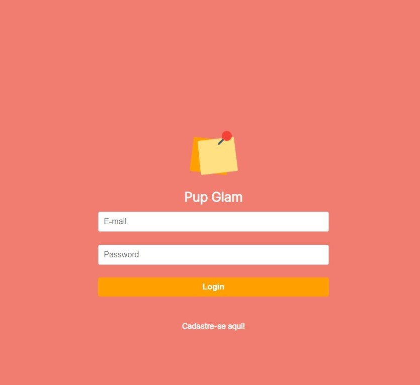
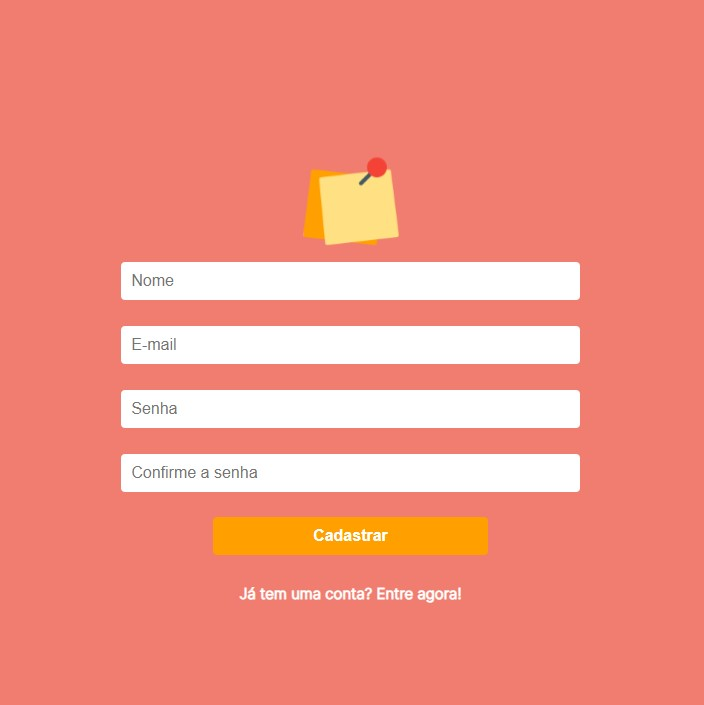
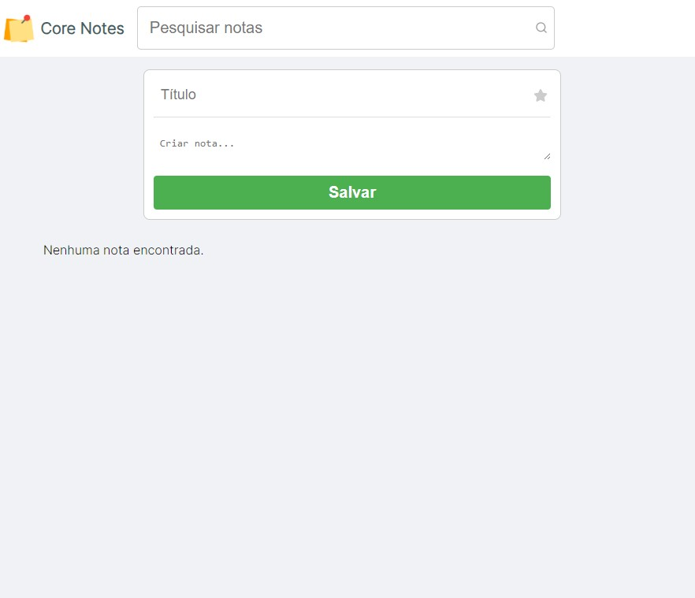
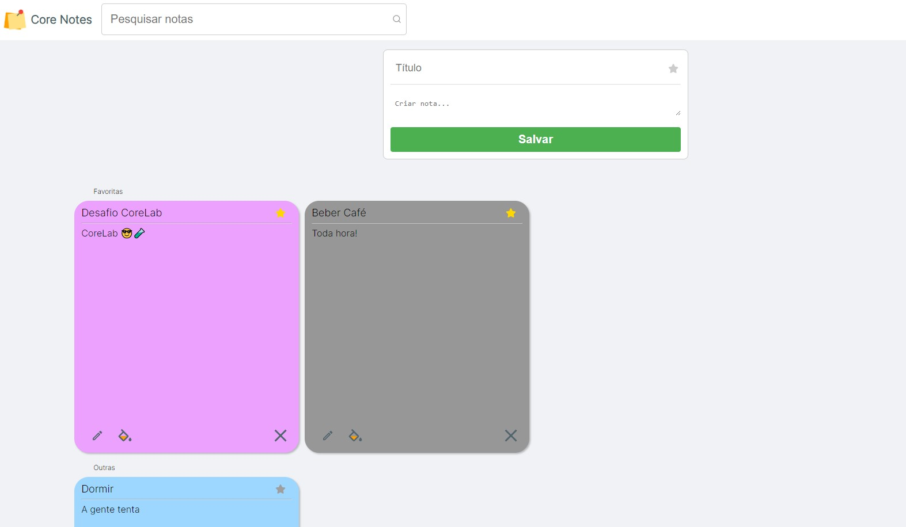

# CoreNotes

Core Notes is a to-do list website where you can better organize your activities and avoid forgetting anything!

## How to use?

Core Notes is a straightforward site to use. If the user has an account, they will need to log in to access:



If the user is new, they should create an account to log in. Click on `cadastre-se aqui!`:



Now the user is in their feed, where they have access to their notes and can create new ones, editing both their content and color:



Now the user can access all their notes and manage them:


## How to run the application?

o run the "Core Notes" application locally, follow these instructions:

1. **Clone o repositório:**

   ```bash
   git clone https://github.com/Kess220/corelab-web-challenge

   ```

2. **Install dependencies:**

   ```bash
   npm install ou yarn install

   ```

3. **Configure the .env according to the .env.example:**

```bash
VITE_API_URL=linkdaAPI

```

4. **Start the application:**

   ```bash
   npm run dev ou yarn dev

   ```

## Deploy

https://corelab-web-challenge-beta.vercel.app
