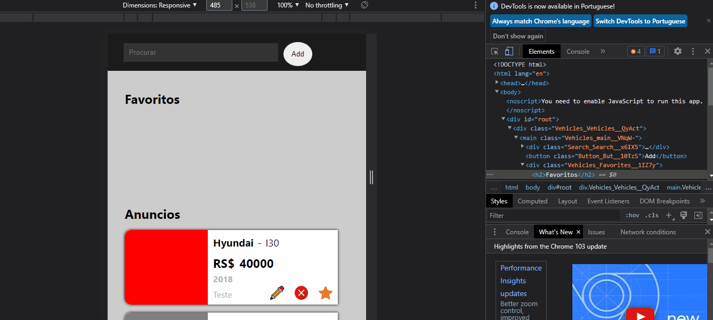

## Corelab Challenge

✅ Criado com TypeScript
✅ Framework NextJS
✅ SCSS Pré-Processador

<h2>Componentes</h2>

Existem 5 componentes, mas entre eles existe

os Modais e o Card.

Os Modais é o que apresenta os formulários de Add e Edit

e ambos compartilham o mesmo @mixin.

O Card é o que apresenta os dados vindo do servidor

e apresenta a cor que o usuário escolher.

<h2>Filtro e Favoritos</h2>

O projeto possui um campo de busca que filtra os cards por

nome ou marca.

Podemos adicionar cards aos favoritos, aonde ficaram localizados

em um lugar mais acessível.

<h2>Types</h2>

A aplicação possui apenas 2 tipos, o da requisição para /cars

e os tipos dos Modais

  

# Conclusões

De antemão queria dizer que adorei trabalhar nesse projeto

e pude perceber a importância do TS e de pré-processadores css

nas aplicações. Algumas coisas com o arquivo API, o SCSS e a organização de

pastas usado de base para iniciar o projeto me surpreenderam e garanto que vou

levar esses conhecimentos para toda carreira.

 

Queria agradecer a oportunidade e pedir para me retornarem um feedback de onde posso melhorar,

queria pedir também a pessoa que criou a base para a criação do projeto me contactar e dizer

como e com qual mindset ele criaria esse projeto

 

Agradeço a oportunidade, Obrigado!
